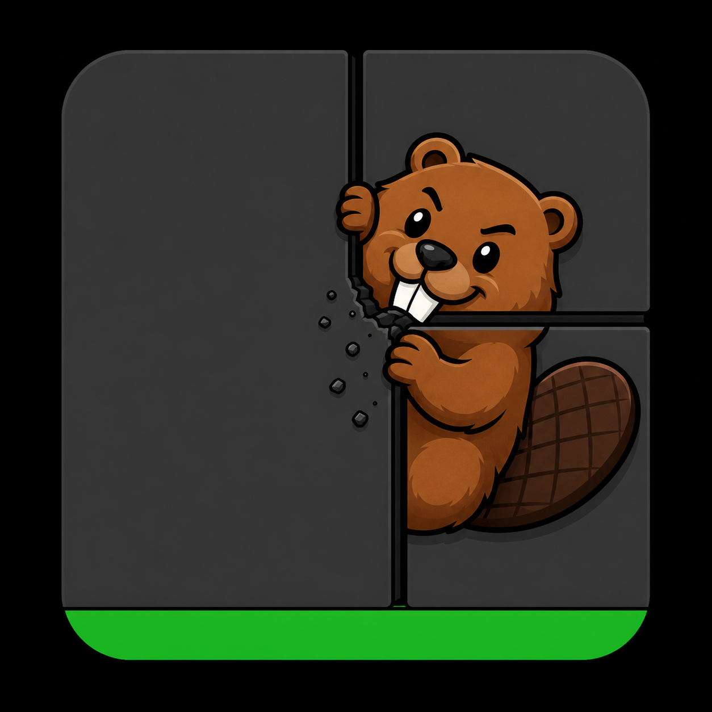

Welcome to tmux!

tmux is a terminal multiplexer: it enables a number of terminals to be created,
accessed, and controlled from a single screen. tmux may be detached from a
screen and continue running in the background, then later reattached.

This release runs on OpenBSD, FreeBSD, NetBSD, Linux, macOS and Solaris.

* Dependencies

tmux depends on libevent 2.x, available from:

	https://github.com/libevent/libevent/releases/latest

It also depends on ncurses, available from:

	https://invisible-mirror.net/archives/ncurses/

To build tmux, a C compiler (for example gcc or clang), make, pkg-config and a
suitable yacc (yacc or bison) are needed.

* Installation

To build and install tmux from a release tarball, use:

	$ ./configure && make
	$ sudo make install

tmux can use the utempter library to update utmp(5), if it is installed - run
configure with --enable-utempter to enable this.

To get and build the latest from version control - note that this requires
autoconf, automake and pkg-config:

	$ git clone https://github.com/tmux/tmux.git
	$ cd tmux
	$ sh autogen.sh
	$ ./configure && make
	$ sudo make install

* Ghostty VT backend

The Ghostty VT parser backend is optional. It must be enabled at build time
and at runtime.

The default Nix package builds with the Ghostty VT backend enabled:

	$ nix build

For a local development build, use the Zig build and enable the ghostty-vt
option:

	$ nix develop
	$ zig build -Dghostty-vt=true -Dutf8proc=true

This requires libghostty-vt to be available through pkg-config. The Nix package
and dev shell include the required Ghostty VT package.

After starting the built binary, enable the backend globally with:

	:set -g ghostty-vt on

Or enable it for only the current pane with:

	:set -p ghostty-vt on

If tmux was built without -Dghostty-vt=true, the ghostty-vt option will not
switch panes to the Ghostty VT backend because the backend code is not linked
into the binary.

* Contributing

Bug reports, feature suggestions and especially code contributions are most
welcome. Please send by email to:

	tmux-users@googlegroups.com

Or open a GitHub issue or pull request.

* Documentation

For documentation on using tmux, see the tmux.1 manpage. View it from the
source tree with:

	$ nroff -mdoc tmux.1|less

A small example configuration is in example_tmux.conf.

Other documentation is available in the wiki:

	https://github.com/tmux/tmux/wiki

Also see the tmux FAQ at:

	https://github.com/tmux/tmux/wiki/FAQ

A bash(1) completion file is at:

	https://github.com/scop/bash-completion/blob/main/completions/tmux

For debugging, run tmux with -v and -vv to generate server and client log files
in the current directory.

* Support

The tmux mailing list for general discussion and bug reports is:

	https://groups.google.com/forum/#!forum/tmux-users

Subscribe by sending an email to:

	tmux-users+subscribe@googlegroups.com

* License

This file and the CHANGES files are licensed under the ISC license. All other
files have a license and copyright notice at their start.
